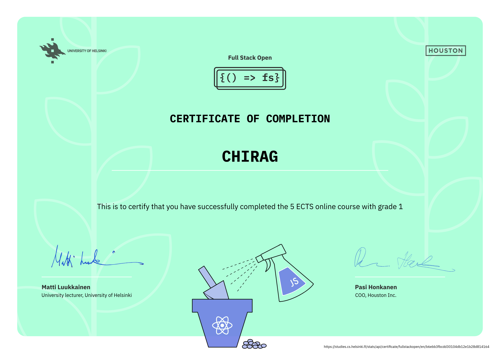

# Full Stack Open – University of Helsinki

---

This repository contains my submissions for the [Full Stack Open](https://fullstackopen.com/en/) course by the University of Helsinki.

---

## Course Progress

| Part | Topic | Status |
|------|------|--------|
| Part 0 | Fundamentals of Web Apps | ☑️ |
| Part 1 | Introduction to React | ☑️ |
| Part 2 | Communicating with Server | ☑️ |
| Part 3 | Programming a Server with Node.js and Express | ☑️ |
| Part 4 | Testing Express Servers, User Administration | ☑️ |
| Part 5 | Testing React Apps | ⬜ |
| Part 6 | Advanced State Management | ⬜ |
| Part 7 | React Router, Custom Hooks, Styling | ⬜ |
| Part 8 | GraphQL | ⬜ |
| Part 9 | TypeScript | ⬜ |
| Part 10 | React Native | ⬜ |
| Part 11 | CI/CD | ⬜ |
| Part 12 | Containers | ⬜ |
| Part 13 | Using Relational Databases | ⬜ |
| Part 14 | Next.JS | ⬜ |
---

## Course Certificates

